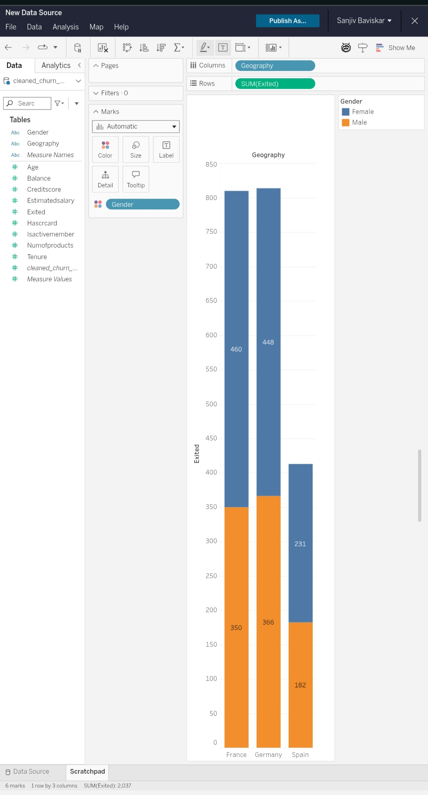
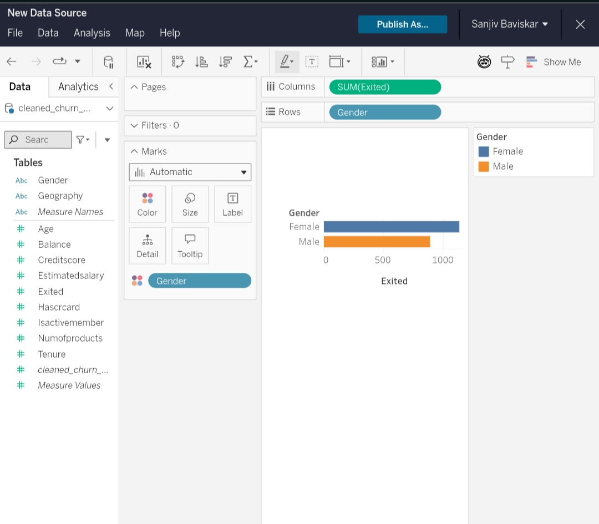
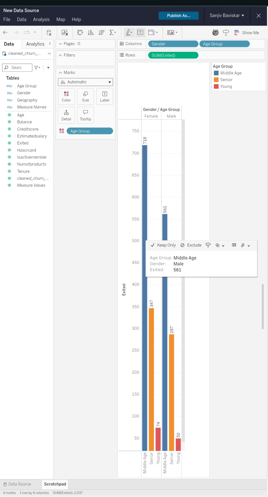
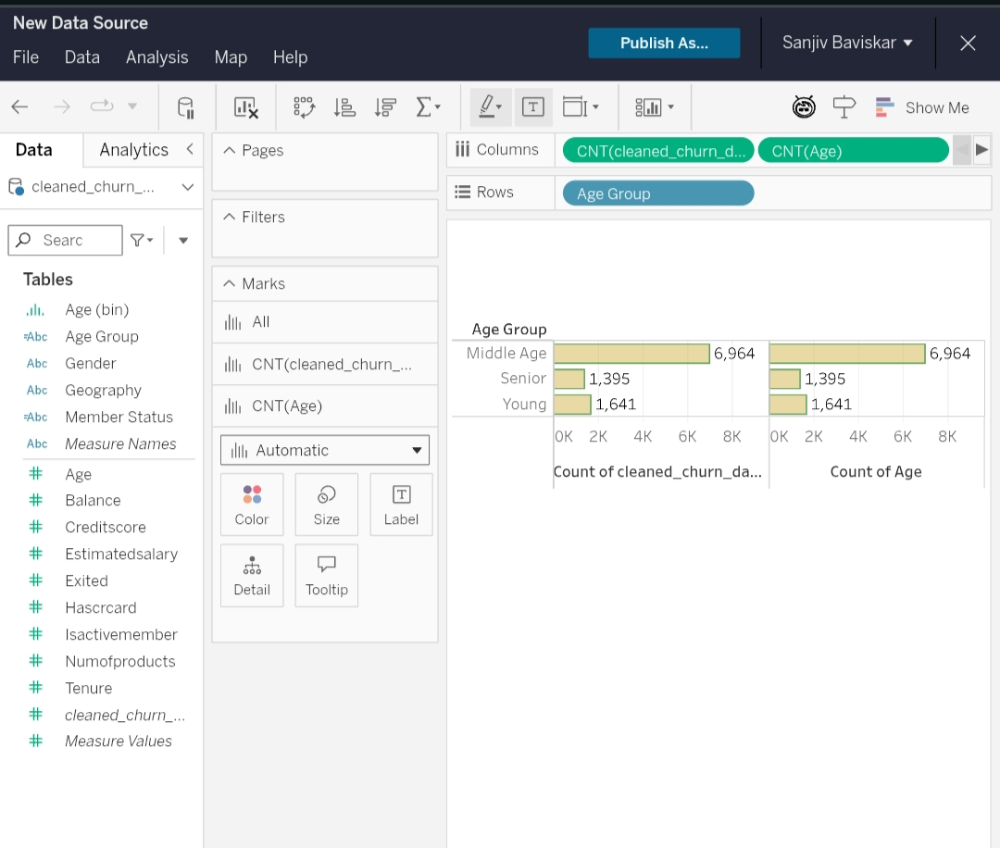
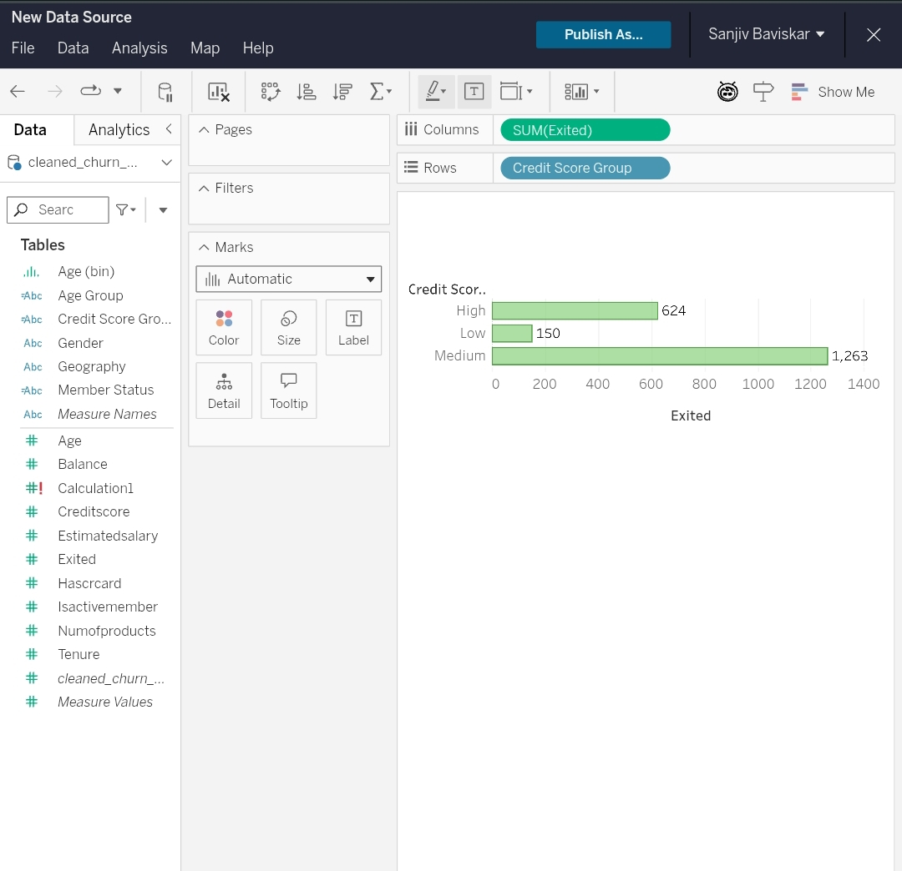
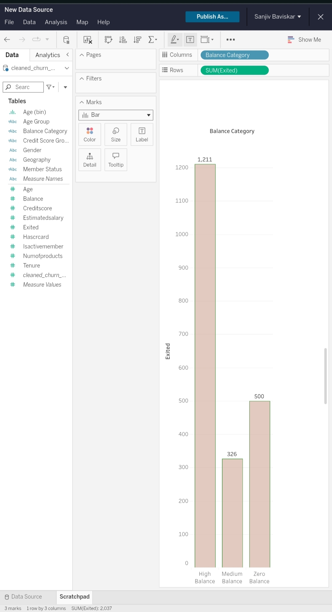

# Bank Customer Churn Analysis

## Project Overview
This project analyzes customer churn behavior in a banking dataset using Python, SQL, and Tableau.  
The goal of the analysis is to identify factors influencing customer churn and generate business insights to improve customer retention.

---

## Tools & Technologies Used
- Python
- Pandas
- NumPy
- SQL
- Tableau
- Google Colab

---

## Project Workflow
1. Data Collection  
2. Data Cleaning  
3. Exploratory Data Analysis (EDA)  
4. SQL-Based Analysis  
5. Customer Segmentation  
6. Data Visualization  
7. Business Insights Generation  
8. Recommendations

---

## Key Analysis Performed
- Customer churn analysis by geography
- Gender-based churn analysis
- Age group segmentation
- Active vs inactive customer analysis
- Credit score risk analysis
- Balance category analysis
- SQL-based KPI reporting
- Customer behavior analysis

---

## Tableau Visualizations

### Geography vs Churn

### Gender vs Churn

### Age Group vs Churn

### Active vs Inactive Members

### Credit Score Group vs Churn

### Balance Category vs Churn

---

## Business Insights
- Germany showed the highest customer churn rate.
- Senior customers were more likely to leave the bank.
- Inactive members had significantly higher churn behavior.
- Customers with lower credit scores represented high-risk segments.
- Certain balance categories demonstrated increased churn probability.

---

## Recommendations
- Improve retention campaigns for senior customers.
- Increase engagement initiatives for inactive members.
- Provide personalized offers to high-risk customers.
- Enhance customer support and loyalty programs.
- Develop targeted financial products for at-risk segments.

---

## Conclusion
This project demonstrates practical data analytics skills using Python, SQL, and Tableau for customer churn analysis.  
The analysis helped identify customer behavior patterns, churn risk factors, and actionable business recommendations to support customer retention strategies.

---

## Author
Sanjiv Baviskar
